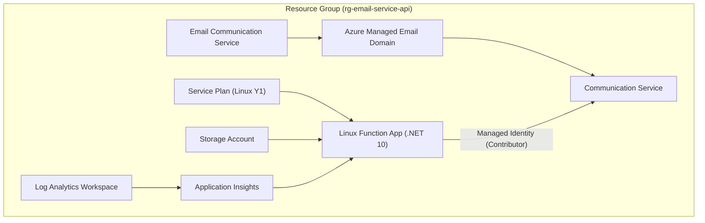

# Email Service

Shared Azure Function that facilitates email communication using Azure Communication Services for email delivery. Built with C# .NET 10 (isolated worker), secured with Managed Identity and Function Keys.

## Architecture Diagram



## Prerequisites

1. An active Azure subscription.
2. Terraform installed on your local machine. You can download it from [here](https://www.terraform.io/downloads.html).
3. Azure CLI installed on your local machine. You can download it from [here](https://docs.microsoft.com/en-us/cli/azure/install-azure-cli).

## Installation

1. Create a blob storage container for Terraform backend (if not already created):

    ```sh
    az group create -l uksouth -n rg-terraform-state
    az storage account create -n stterraformstategze5 -g rg-terraform-state
    az storage container create -n tfstate --account-name stterraformstategze5
    ```

2. Navigate to the project directory:

    ```sh
    cd "TerraformSolutionSamples/Email Service"
    ```

3. Create your backend config from the example:

    ```sh
    cp backend.example.conf backend.conf
    ```

    Update `backend.conf` with your Azure storage details.

4. Create your variables file from the example:

    ```sh
    cp terraform.tfvars.example terraform.tfvars
    ```

    Update `terraform.tfvars` with your subscription ID, recipient email, and allowed origins.

## Usage

1. Authenticate with Azure and initialise Terraform:

    ```sh
    az login
    terraform init -backend-config=backend.conf
    ```

2. Plan and apply the Terraform configuration:

    ```sh
    terraform plan
    terraform apply
    ```

3. After applying, deploy the function code from the [EmailServiceApi](https://github.com/froxtrox/EmailServiceApi) repository:

    ```sh
    cd path/to/EmailServiceApi/EmailServiceAPI
    func azure functionapp publish func-email-service-api
    ```
